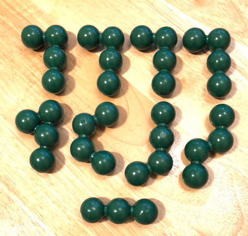
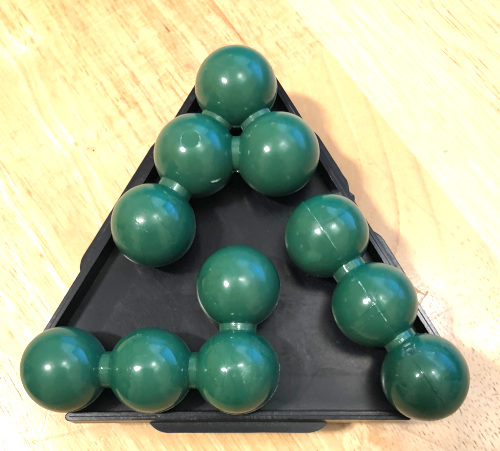
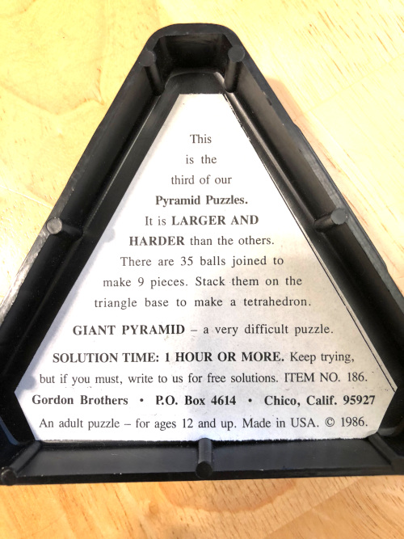
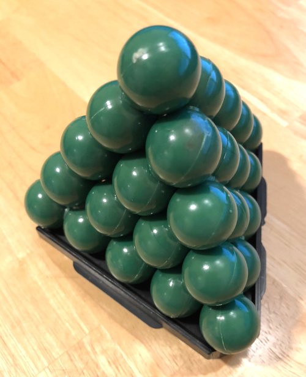

# Giant Pyramid Solver
This is a repository for the solver and the solution for the Giant Pyramid puzzle

I bought mine around 2000. As of 2017 it is no longer sold. There is
some description of the puzzle on this page: http://www.gamepuzzles.com/giantpyr.htm
The author of the puzzle claims that there is only one solution. In fact there are
2 solutions that are mirror images of each other. I emailed him about it and he claimed
that the mirror images do not count as they are the same. Think about that next time
you want to put a left glove on your right hand.

The Giant Pyramid is a tetrahedron composed of 35 balls, 5 balls to a side. It is assembled
from 9 pieces of 6 different kinds (4 pieces are the same). 8 pieces are made of 4 balls
and 1 piece is made of 3 balls. The goal of the puzzle to put the pieces together to form
a perfect tetrahedron.

The 9 pieces:

A few pieces on the base (not necessarily in place):

The text on the back of the base:

Pyramid layers with position labels

<pre>
     0
    1 5
   2 6 9
  3 7 10 12
 4 8 11 13 14

       15
     16 19
   17 20 22
 18 21 23 24

     25
   26 28
 27 29 30

   31
 32 33

 34
 </pre>

 Piece labels

 1. 3-ball
 2. piece with a 60-degree arm
 3. piece with the triangle
 4. trans-piece
 5. cis-piece
 6. the piece with 90-degree bend
 7. Same as 6
 8. Same as 6
 9. Same as 6

 Positions of the pices in the solved puzzle:
<pre>
 Piece id: 1 1 1 4 3 6 7 4 3 2 7 8 2 7 2 6 6 6 3 2 4 9 4 8 7 5 5 3 8 9 8 9 5 9 5
 Index:    0 1 2 3 4 5 6 7 8 9 0 1 2 3 4 5 6 7 8 9 0 1 2 3 4 5 6 7 8 9 0 1 2 3 4
</pre>

<pre>
 1   0,1,2
 2   9,12,14,19
 3   4,8,18,27
 4   3,7,20,22
 5   25,26,32,34
 6   5,15,16,17
 7   6,10,13,24
 8   11,23,28,30
 9   21,29,31,33
 </pre>

Solved puzzle

## Solver

The brute force solver would have to check 883,702,234,255,196,160 (or 8.8E17 positions). Intruducing a basic
constraint - if a combination of piece positions already has a clash where two balls occupy the same space,
then no further checking will be done on this combination - pares down this number to 52.6 million. This number
can be searched on a modern MacBook Pro laptop in 3.06 seconds.
